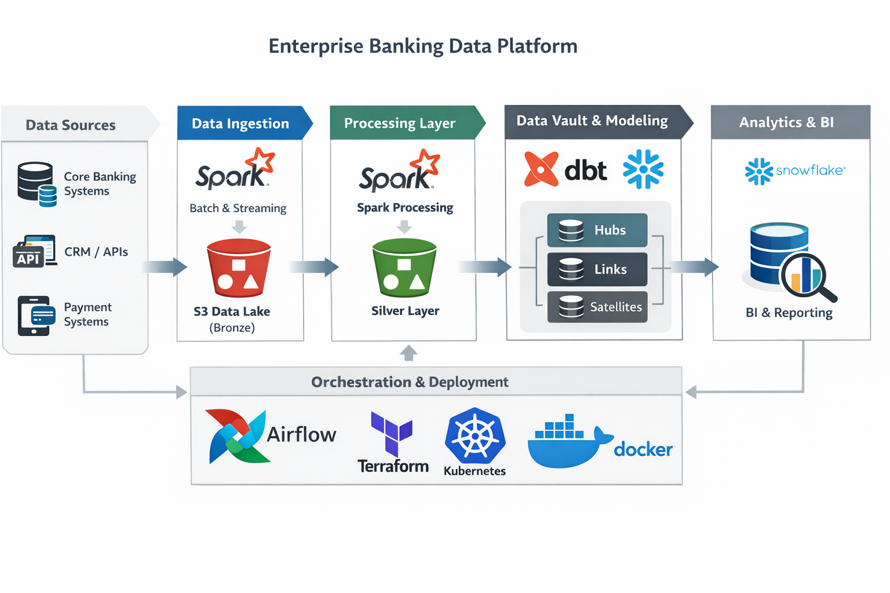

# Enterprise Big Data Platform 🏦
### Domain: Banking

<!-- ---------------  Scope  --------------- -->
## Project Overview
A fully-encrypted, audit-ready analytics platform that ingests **millions of banking events per hour**, lands them in S3 (Bronze), cleans & conforms in Snowflake (Silver), and exposes business-ready Data-Vault marts (Gold) to downstream BI, AML, and regulatory teams. This project demonstrates a scalable, enterprise-grade banking data platform using modern Data Engineering and DevOps best practices. It ingests, processes, models, and serves banking data at scale using **AWS, Snowflake, Spark, Airflow, dbt, Docker, Terraform, and Kubernetes (K8s).**

<!-- ---------------  ARCHITECTURE DIAGRAM  --------------- -->
## Architecture

## Key Features

- **Cloud-Native**: AWS S3, Snowflake, K8s-managed Spark and Airflow.
- **Orchestrated Pipelines**: Airflow DAGs for batch and streaming ingestion.
- **Modular dbt Models**: Hub, Link, Satellite layers for clean data modeling.
- **Big Data Processing**: Spark handles large transaction and payment datasets efficiently.
- **Security & Governance**: Snowflake role-based access, audit logs, encrypted data at rest.
- **Infrastructure as Code (IaC)**: Terraform scripts for reproducible environments.
- **Containerized Deployment**: Docker + K8s for scalable, portable workloads.
